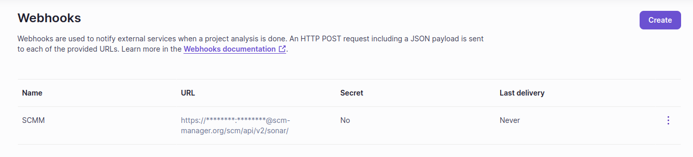

# Einrichtung
Das Sonar Plugin ermöglicht das Empfangen von Sonar Analysen, die von SonarQube bzw. SonarCloud per Webhook verschickt werden können. 
Dazu stellt das Plugin zwei REST Endpunkte bereit, um das Analyse Resultat der Webhooks auszuwerten und an den analysierten Commit im Repository zu hängen.
Die Einrichtung der Webhooks sollte sich in den Tools kaum unterscheiden.

## SonarCloud Webhook
In SonarCloud können Webhooks pro Projekt oder auch pro Organization definiert werden. 
Die Webhooks werden automatisch nach dem Ausführen einer Analyse getriggert, unabhängig von Resultat der Analyse.
Die empfohlene Vorgehensweise zum Einrichten der Sonar Webhooks gegen den SCM-Manager Server wird hier vorgestellt.

### Beispiel
Wir richten einen neuen Webhook für unser Sonar Projekt ein. Dafür wählen wir als URL den Endpunkt im SCM-Manager: `https://{instanceUrl}/scm/api/v2/sonar`
Damit dieser Webhook am SCM-Manager akzeptiert wird, müssen Zugangsdaten mitgeschickt werden. 
Dabei wird üblicherweise ein technischer Benutzer gewählt, der mit den Rechten zum Schreiben der CI Status ausgestattet sein muss.
Benutzername und Passwort können wir in den vorderen Teil der URL schreiben, z.B. `https://Testnutzer:Passwort123@{instanceUrl}/scm/api/v2/sonar`.
Anstatt dem Passwort kann auch ein SCMM API Key genutzt werden.
Der Payload des Sonar Webhooks wird automatisch aus den Daten der Analyse erzeugt. 

Damit der SCM-Manager beim Erhalten des Webhooks erkennt, um welches Repository es sich handelt, muss der Repository Name mit dem speziellen Schlüssel `sonar.analysis.scmm-repo` mitgeliefert werden.
Der Wert des Schlüssels muss `{{repositoryNamespace}}/{{repositoryName}}` enthalten. 

Beispiel für das Triggern einer SonarCloud Analyse: 
`sonarqube -Dsonar.organization=scm-manager -Dsonar.branch.name=develop -Dsonar.analysis.scmm-repo=scm-manager-plugins/scm-tagprotection-plugin`

Weitere Informationen zu den Sonar Webhooks gibt es in der [Dokumentation](https://docs.sonarcloud.io/advanced-setup/webhooks/).

